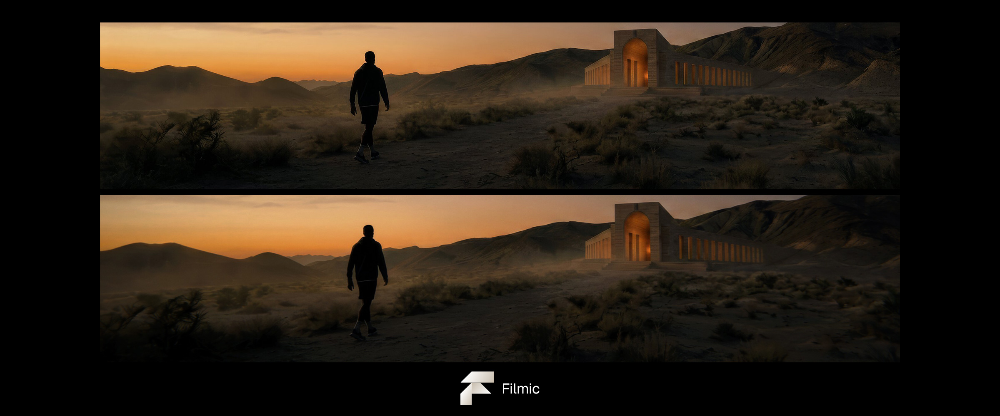
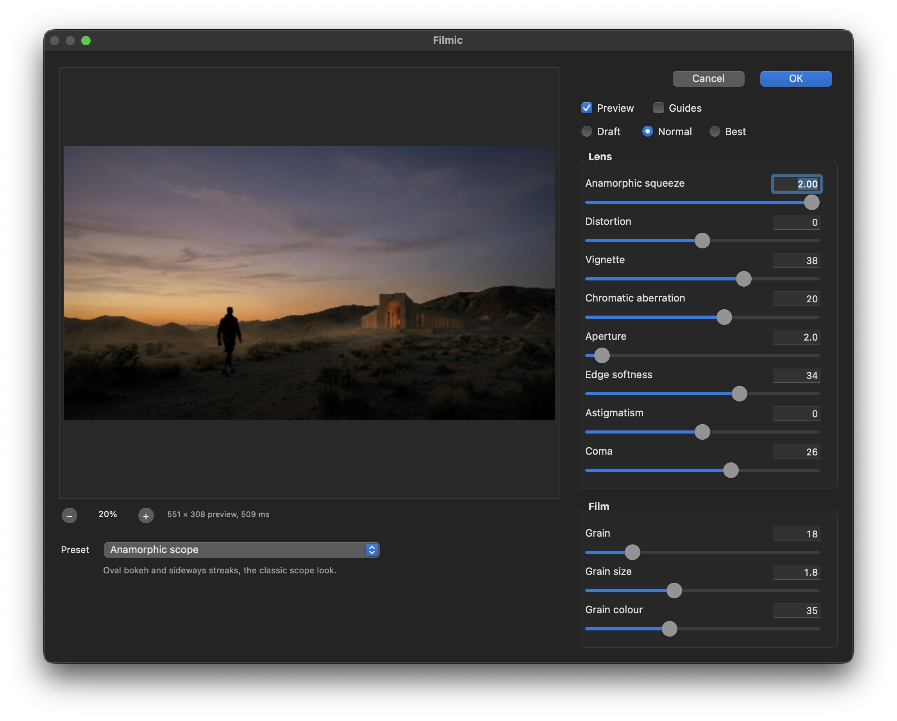

<p align="center">
  
</p>

<h1 align="center">Filmic</h1>

<p align="center">
  A physically-based lens and film filter for Adobe Photoshop.<br>
  <strong>macOS only.</strong>
</p>

---

## Why this exists

I kept rebuilding the same thing. Every project, some version of the same stack of
adjustment layers and blurs to make a render look like it came through glass, and
every project I'd throw it away and do it again. So I built it properly, once, for
myself.

It is not perfect science everywhere. There are corners of it that are honest
approximations and a few that are frankly a look rather than a model — the
[Known limits](#known-limits) section says which. But it does everything I need
it to do, and it does the parts that matter from the physics rather than by
faking them.

Most "lens effect" filters fake it: a blur here, a gradient there, a noise
layer on top. Filmic starts from the optics instead. It upsamples every pixel to
a spectrum, propagates each wavelength through a pupil with a real wavefront, and
integrates the result back to colour. Chromatic aberration falls out of the
wavelengths disagreeing. Corner softness falls out of the field curving. Vignetting
falls out of the pupil clipping.

That is a slower way to get there, and it is the reason the corners of an image
look like a lens rather than like a filter.

**Filter → Moggach → Filmic…**

<p align="center">
  
</p>

<p align="center">
  <em>The Anamorphic scope preset. The preview is live — drag a slider and it
  follows.</em>
</p>

## What it does

| Control | What it is |
|---|---|
| **Anamorphic squeeze** | An oval pupil: oval bokeh, sideways-streaking highlights |
| **Distortion** | Brown-Conrady radial distortion, barrel through pincushion |
| **Vignette** | Natural cos⁴ falloff and mechanical pupil clipping together |
| **Chromatic aberration** | Lateral colour, plus the residual of a corrected lens |
| **Aperture** | T-stop; sets how large the point spread function grows |
| **Edge softness** | Petzval field curvature — sharp centre, soft edge |
| **Astigmatism** | Sagittal and tangential foci apart: edge detail smears |
| **Coma** | Off-axis rays flaring corner highlights into comet tails |
| **Grain** | Amplitude follows √(v(1−v)) — strongest in the mid tones, as on film |

Presets cover cinema looks, photographic lens types, and four characters drawn
from families of real glass. You can save your own, and export them as JSON to
travel with a project.

Astigmatism, coma and field curvature are **field-dependent**: they are zero at
the centre of the frame and grow toward the corners, which is what makes them
read as a lens rather than as an effect applied evenly.

## Requirements

- **macOS.** Apple silicon or Intel; the plug-in ships as a universal binary.
  There is no Windows build. The optics core is portable C++20, but the dialog
  is Cocoa.
- **Adobe Photoshop** 2021 or later. Tested on Photoshop 2026 (27.6).
- 8, 16 and 32 bits per channel; RGB and Grayscale.

## Installing

Copy `Filmic.plugin` into Photoshop's plug-ins folder and restart:

```
/Applications/Adobe Photoshop 2026/Plug-ins/
```

That folder is owned by root, so either make it writable once or copy with
`sudo`. Photoshop 2026 no longer offers an "Additional Plug-ins Folder"
preference, so this is the only location it scans.

The bundle is ad-hoc signed. That is enough: Photoshop runs with the hardened
runtime but sets `com.apple.security.cs.disable-library-validation`, so a
plug-in that Apple has not signed still loads. For distribution, sign with a
Developer ID as `com.moggach.filmic`.

## Building

You need the Adobe Photoshop SDK. It is **not** vendored here — it is
licence-restricted, so you must download your own copy from
[Adobe's developer site](https://developer.adobe.com/photoshop/).

```bash
cmake -B build -DLENS_PS_SDK_ROOT=/path/to/photoshopsdk/pluginsdk
cmake --build build --target install-filter
```

`install-filter` builds, signs and copies the bundle into place. Point it
somewhere else with `-DLENS_FILTER_INSTALL_DIR=...`.

Run the tests with:

```bash
cmake --build build --target lens_tests && ./build/tests/lens_tests
```

## How it is put together

```
lenscore/     header-only optics. The whole value of the project lives here.
  color/      spectral upsampling, CIE integration, the Rec.2020 table
  optics/     pupil, wavefront, PSF rings, distortion, vignetting
  conv/       FFT and the spatially-varying convolution
  film/       grain
lens8bf/      the Photoshop filter: entry points, Cocoa dialog, presets
lensdata/     the prebuilt spectral table and lens files
rgb2spec/     regenerates that table
lenscli/      renders through the pipeline without Photoshop, for testing
tests/        178 tests
docs/         the design spec and implementation plan
```

The order of operations follows the light: geometric distortion, then spectral
upsampling, then lateral colour per wavelength, then the field-varying point
spread function, then reconstruction to RGB, then vignetting, then the highlight
knee, and finally grain — because the emulsion records whatever the lens
delivered.

## Known limits

These are measured, not guessed.

- **Colour.** Saturated reds beyond what a bounded reflectance spectrum can
  reach are gamut-mapped, and land about 0.10 of full scale off. The sigmoid
  model shares that limit with the dense spectral integral; it is not the
  quadrature. Quality below 7 wavelengths is not offered because it is not
  merely coarse, it is wrong — three bands put that same red out by 0.43.
- **Flat-field ripple.** Under hard aberration the convolution leaves about 3.4%
  brightness ripple. Overlapping patches carry different kernels, and while
  their windows sum to one, those windows convolved with different kernels do
  not. It scales with how hard the controls are driven.
- **Mechanical vignetting** is applied per pixel after the convolution rather
  than by clipping the pupil per field angle. The falloff is right; corner bokeh
  stays round where a fast lens would give cat's-eye.
- **Speed.** Roughly 1 second per megapixel at Normal quality with the blur
  stage active; the spectral and warp stages are far cheaper. The preview drops
  to 7 wavelengths while you drag a slider.

## Licence

[MIT](LICENSE). Do what you like with it. It comes with no warranty and no
promise of maintenance.

The Adobe Photoshop SDK is not included and is subject to Adobe's own terms.
